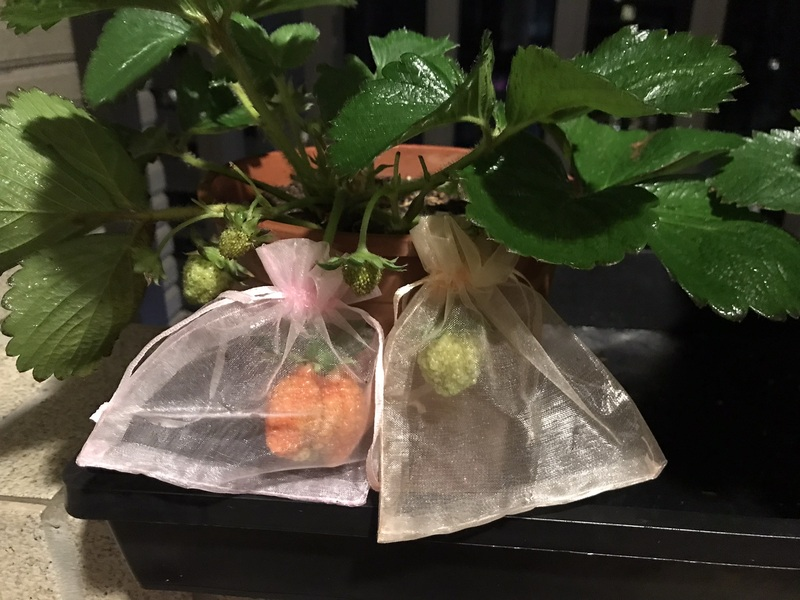
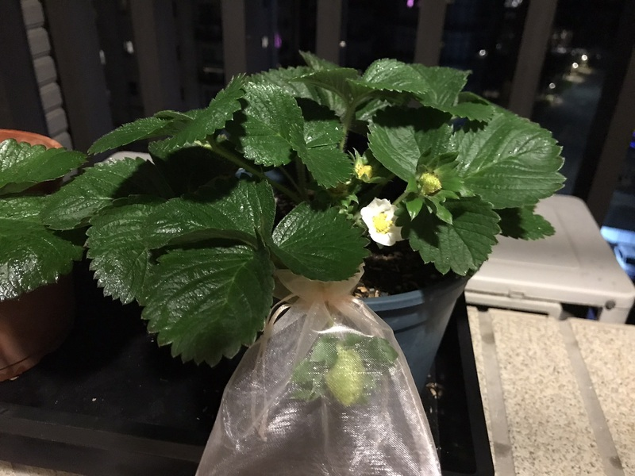
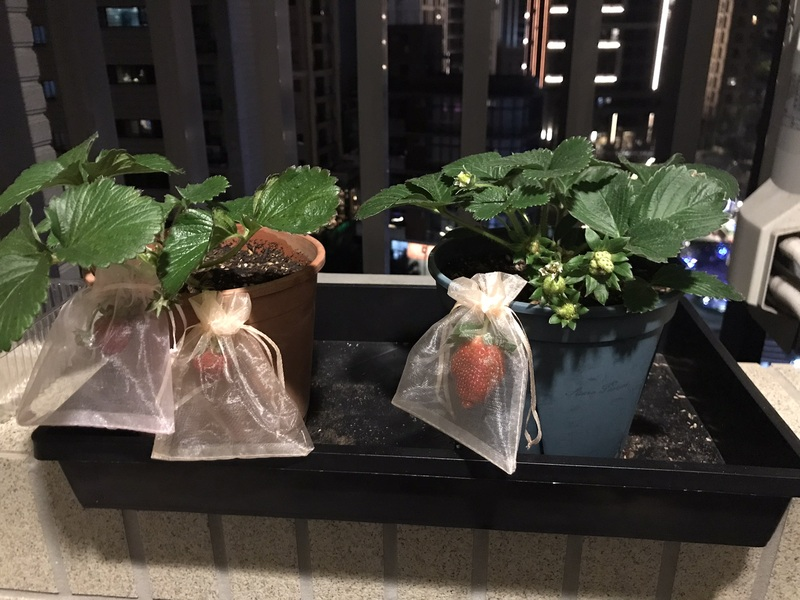
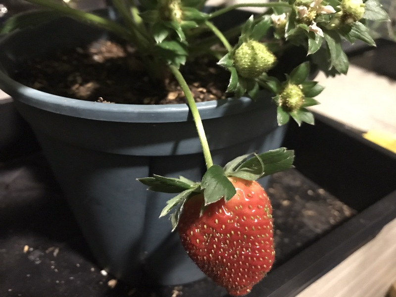
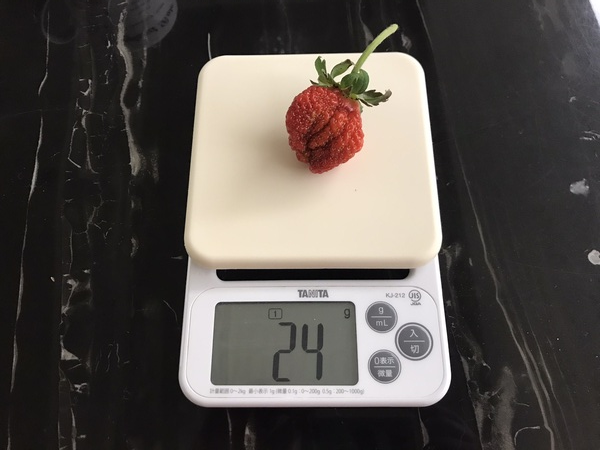
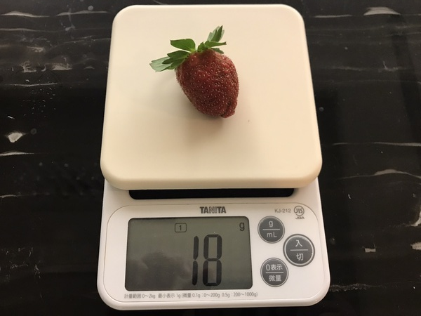

# 草莓栽種紀實

**品種:** 未知(猜測為桃園四號)
**日期:** 2023/12/31
**地點:** 林口區
**位置:** 陽台(七層/十五層)
**日照:** 朝西南方, 半日照
**數量:** 2 盆(六吋盆)
**來源狀態:** 已開花結果(紅盆), 尚未開花(綠盆)
**栽種紀錄:**

  * 先將盆栽上的雜草移除
  * 將盆內的緩釋肥(好康多)移出, 重新放入約 10 克
  * **水分補給:** 使用噴水瓶, 將介質噴濕(約2~3天噴濕), 每日清晨噴濕葉面(陰雨天不噴), 每周澆透水一次(低溫不澆水)
  * **追肥:** 高磷鉀酵素(解憂草莓園提供), 加水稀釋200倍葉噴(紅盆), 加水稀釋100倍噴介質(綠盆), 每周噴一次
  * **蟲害:** 第三周出現中度蟲害, 判斷應為葉蟎, 葉面及葉背都有, 一開始只有紅盆發現蟲害(已開花結果), 使用葵無露(稀釋200倍)防治, 用刷子刷洗葉面及葉背, 隔天觀察發現有藥傷, 然後綠盆(剛開花結果)開始有輕度蟲害, 改使用稀釋300倍的葵無露防治
  * **收穫:** 皆為第一期果, 試吃員為 12 歲小男孩(只有那兩顆過熟的是我吃的)

      **紅盆**
      **2024/02/04** 採收第1顆果(約 24 克重, 偏酸不甜有果香, 果肉結實)
      **2024/02/16** 採收2顆果(過熟)(各約 7 克重, 偏酸不甜果香淡, 一顆果肉結實, 另一顆軟爛)

      **綠盆**
      **2024/02/16** 採收第1顆果(約 18 克重, 酸甜適中果香濃, 果肉結實)
          

**目前狀態:**

  **紅盆**
  感覺即將陣亡(應該是藥傷造成, 之前的老葉枯黃及黑點懷疑是炭疽病)

  **綠盆**
  狀況良好, 只是開花過於緩慢(懷疑是日照不足造成)

**拍攝日期 2023/01/31, 紅盆**

**拍攝日期 2023/01/31, 綠盆**

**拍攝日期 2023/02/16, 採收前的狀態**

**拍攝日期 2023/02/16, 綠盆大果(開花日期約為 2023/01/12)**

**拍攝日期 2023/02/04, 紅盆第一顆大果重量**

**拍攝日期 2023/02/16, 綠盆第一顆大果重量**

